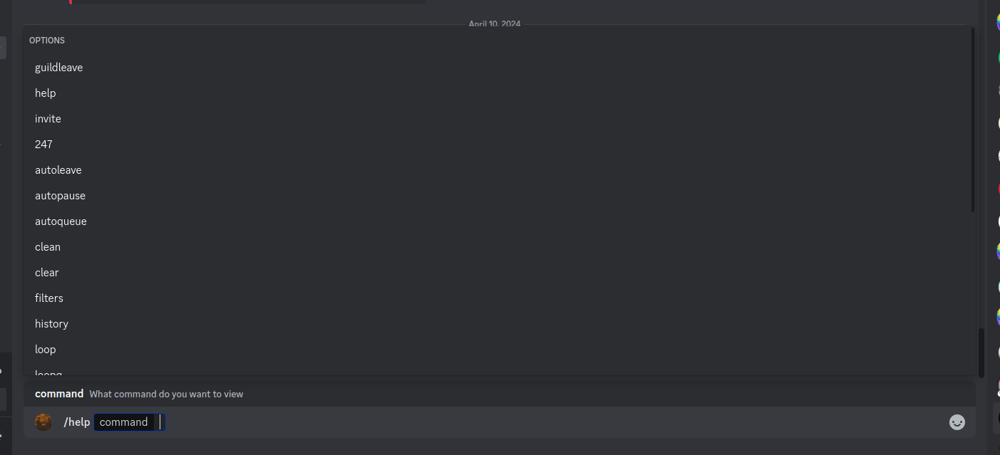
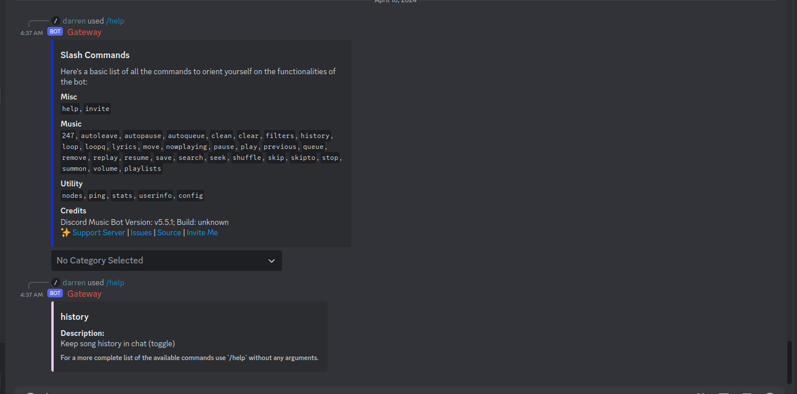
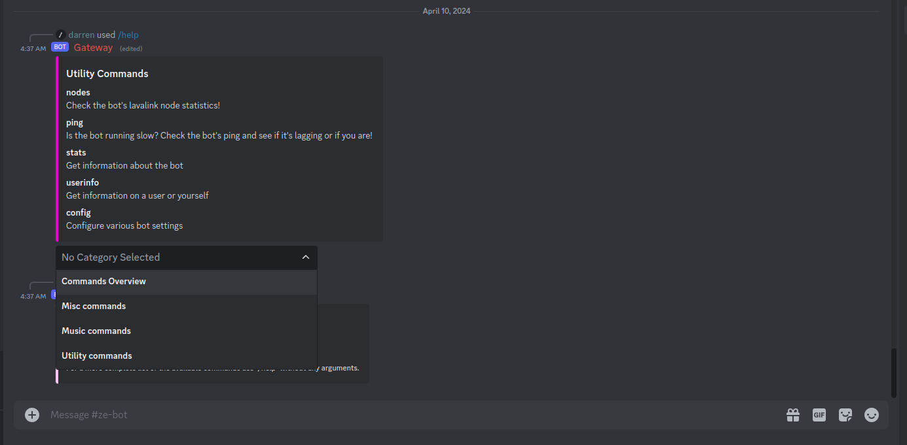
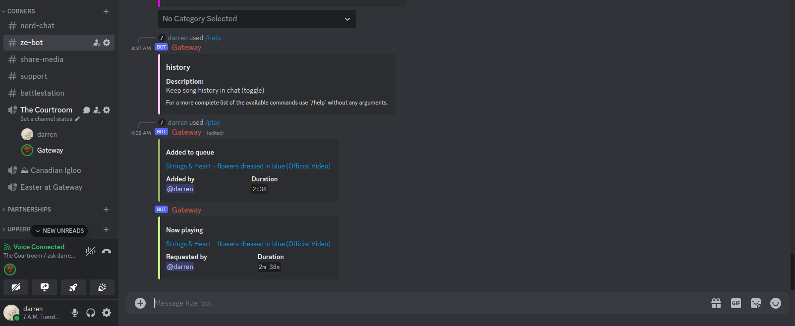
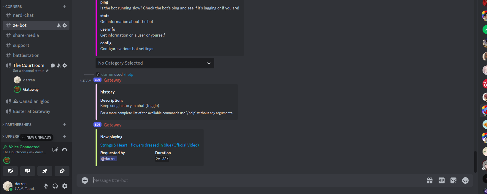
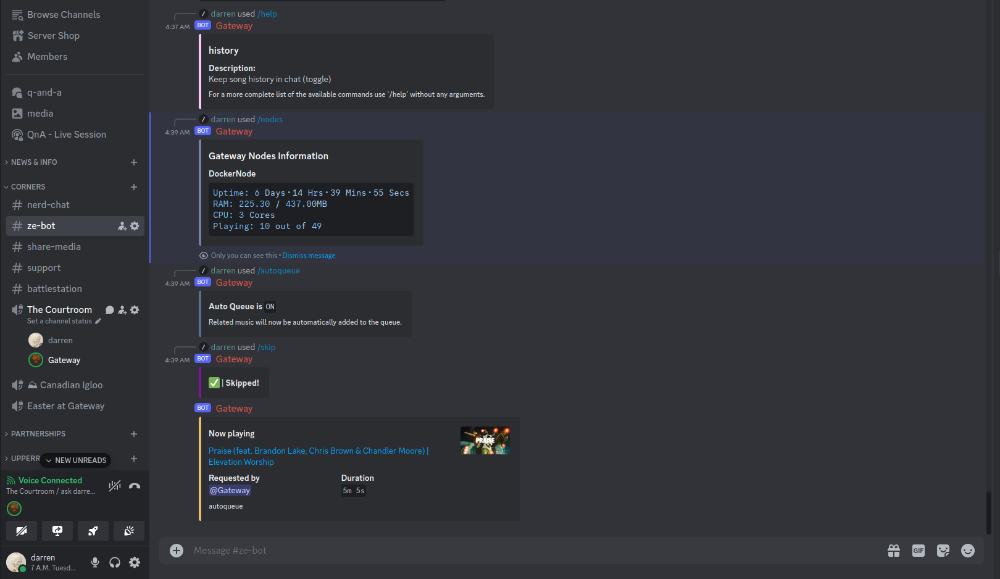
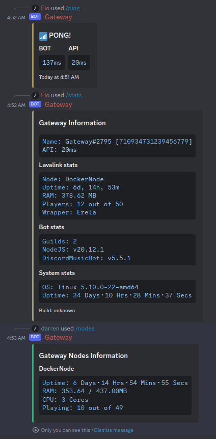

<h1 align="center"> Discord Music Bot </h1>

*P.S. Screenshot / Preview at the bottom of ReadMe :)*

## 🚧 | Prerequisites

- [Docker](https://www.docker.com/)
- Optionally: [GNU Make](https://www.gnu.org/software/make/)

## 📝 | [Tutorial](https://dmb.darrennathanael.com/v5/)

[Discord Music Bot V5 Docs](https://dmb.darrennathanael.com/v5/)

[Expert version](https://git.dpaste.org/dmb/DiscordMusicBot-Docs/src/branch/main/docs/v5/index.md)

## 📝 | [Support Server](https://discord.gg/sbySMS7m3v)

If you have major coding issues with this bot, please join and ask for help.

## Devlog

```diff
# Current talking points
+ Possible re-write?
> “Rebuild everything from scratch because DJS is being very dumb.” - Brian 3/6/2024

+ Consideration for rewrite (lib)
https://github.com/Didas-git/lilybird

+ v6 has started development
https://git.dpaste.org/dmb/Discord-MusicBot/src/branch/v6
```


## 🚀 | Deploy

- No deployment options have been configured yet

## ✨ | Contributors

Contributions are always welcomed :D Make sure to follow [Contributing.md](https://git.dpaste.org/dmb/Discord-MusicBot/src/branch/develop/CONTRIBUTING.md)

Be sure to push to our new [Git Server](https://git.dpaste.org/dmb/Discord-MusicBot); GitHub is just a mirror!

<a href="https://github.com/wtfnotavailable/Discord-MusicBot/graphs/contributors">
  
</a>

## 🌟 | Made with

- [Discord.js](https://discord.js.org/)
- [Lavalink](https://github.com/lavalink-devs/Lavalink) with erela.js, Cosmicord.js

## 📸 | Preview

"A picture is worth a thousand words"-Someone

<figure>
    
    <figcaption>View and Get infrormation that directly and efficiently; clean and simple</figcaption>
</figure>


<figure>
    
<br><br>
    
    <figcaption>See all available commands or a specific command with ease! Less screen real estate used!</figcaption>
</figure>

<figure>
    
    <figcaption>Search and Play with Ease, no fuss! plus it comes with auto-search functionality to further improve user experience</figcaption>
</figure>

<figure>
    
    <figcaption>The bot will automatically clean previous commands run to prevent clutter even more!</figcaption>
</figure>

<figure>
    
    <figcaption>What's that? bored? feeling lucky? let the bot queue the next song for you!</figcaption>
</figure>

<figure>
    
    <figcaption>All statistics are easily accessible, presented in a manner that everyone can digest.</figcaption>
</figure>

Not convinced yet? Well, I don't know what will convince you then. Either way, the bot is open-source; edit it yourself!
